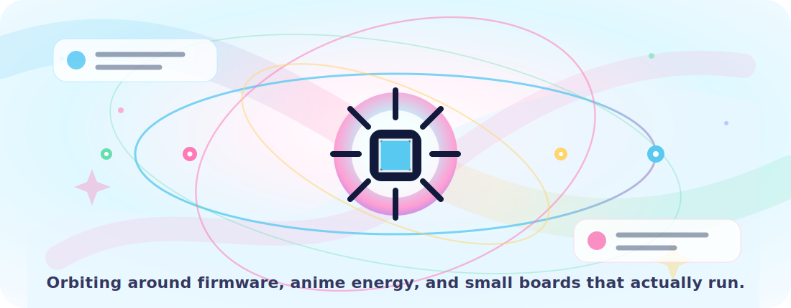
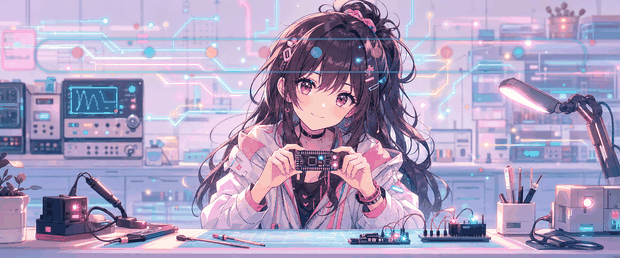

<!--
  ============================================================
   ParacosmYy / GS-Paracosm GitHub Profile README
   Anime resonance panel · Training archive
  ============================================================
-->

  
  
  
  

<h1 align="center">ParacosmYy</h1>

  <strong>修炼中 · 爆发前 · 领域展开中</strong> 
  喜欢热血、觉醒、极致感。顺手和 MCU、Bootloader、RTOS 较劲。

  
  
  

  

---

  
  

  <picture>
    <source media="(prefers-color-scheme: dark)" srcset="https://raw.githubusercontent.com/ParacosmYy/ParacosmYy/output/github-contribution-grid-snake-ocean.svg" />
    <source media="(prefers-color-scheme: light)" srcset="https://raw.githubusercontent.com/ParacosmYy/ParacosmYy/output/github-contribution-grid-snake.svg" />
    
  </picture>

