<!-- 动态打字标题 -->
<p align="center">
  
</p>

<!-- 身份徽章 -->
<p align="center">
  
  
  
</p>

---

## 👤 关于我 · About Me

<p align="center">
  <b>GS-Paracosm</b> · 嵌入式系统工程师 · 西安
</p>

- 🔭 **专注方向**：MCU 高可靠实时控制、工业通信、Bootloader / OTA、电机控制与机器人底层系统
- 🌱 **当前扩展**：MCU → Embedded Linux → Robotics
- 🛠️ **技术信条**：嵌入式开发不能只看代码跑没跑，更要用示波器和逻辑分析仪看到真实波形
- 📫 **合作意向**：Embedded Linux / BSP / Kernel / ROS 开发者，欢迎交流 MCU + MPU 异构系统

---

## 🔧 技术栈 · Tech Stack

### MCU & Core
<p>
  
  
  
</p>

### RTOS
<p>
  
  
  
  
  
  
</p>

### 工业通信 · Industrial Bus
<p>
  
  
  
  
  
  
  
</p>

### 工具链 & 开发环境
<p>
  
  
  
  
  
  
</p>

---

## ⚙️ RTOS 实战矩阵 · RTOS Combat Matrix

| RTOS | 定位 | 掌握重点 | 状态 |
|------|------|----------|------|
| **FreeRTOS** | 主力实战 | Task · Queue · Semaphore · ISR Notify · PendSV · Tick · 内存管理 | ✅ 熟练 |
| **RT-Thread** | 国产生态 | Device Model · FinSH · 组件化 · 中间件 | ✅ 熟练 |
| **Zephyr** | 现代化方向 | Device Tree · Kconfig · West · 驱动模型 | 🔄 深入中 |
| **ThreadX** | 工业/商业 RTOS | 线程调度 · 消息队列 · 内存池 · 低延迟 | 📚 学习中 |
| **CMSIS-RTOS2** | 抽象接口层 | 跨 RTOS API 封装 · Keil / STM32Cube 生态 | ✅ 熟练 |
| **NuttX** | 类 POSIX RTOS | 文件系统 · 驱动框架 · Linux-like 接口 | 🔄 深入中 |
| **LiteOS** | IoT RTOS | 轻量级内核 · IoT 设备适配 | 📚 学习中 |

---

## 🔌 工业总线 · Industrial Bus

### 🔷 物理层 / Physical Layer
`UART` `SPI` `I2C` `RS485` `CAN` `Ethernet` `USB` `OctoSPI`

### 🔷 协议层 / Protocol Layer
`CANopen` `CAN-FD Custom Protocol` `Modbus RTU` `EtherCAT Slave` `IGH EtherCAT Master` `UWB Transparent Bridge`

### 🔷 工程聚焦 · Engineering Focus
```text
帧设计(Frame Design) · PDO/SDO Mapping · 总线时序(Bus Timing)
FIFO / Ring Buffer · DMA Transport · Protocol Parser
CRC Check · Fault Recovery · 实时性优化
```

---

## 🚀 项目实验室 · Project Lab

### ⚡ PMS 电源管理系统 · Power Management System
[](https://github.com/ParacosmYy/PMS-PowerManagementSystem)

- STM32H7 A/B OTA 架构（非活跃分区烧录、CRC16/CRC32 校验、回滚确认）
- ADC + DMA 多通道采样
- 看门狗 & 多故障保护框架

---

### 🌐 EtherCAT → CAN-FD 协议网关 · Protocol Gateway
[](https://github.com/ParacosmYy/EtherCAT-CANFD-Gateway)

- STM32H7 + LAN9253 EtherCAT 从站协议栈移植
- SM0/SM1（SDO 邮箱）、SM2/SM3（PDO 周期数据）
- 1ms 周期控制、DWT 时序测量、PDI 中断抖动诊断

---

### 🤖 灵巧手 CAN-FD 协议栈 · Dexterous Hand Protocol
[](https://github.com/ParacosmYy/DexterousHand-CANFD-Protocol)

- 29-bit 扩展 CAN ID 设备寻址
- DLC 32 综合控制帧设计
- 设备身份 & 配置协议规范
- Little-endian 线格式优化

---

### 🛠️ 嵌入式本地 CI 模板 · Embedded CI Template
[](https://github.com/ParacosmYy/Embedded-CI-Template)

- CMake + Ninja + GCC + clangd 统一构建流
- Docker + WSL2 跨平台工具链
- VSCode / Cursor 嵌入式开发环境
- Git hooks、格式化工作流 & CI 流水线

---

## 🛠️ 硬件平台 · Hardware Workbench

| 类别 | 设备 / 工具 |
|------|------------|
| **🔍 调试器 · Debug Probe** | J-Link ULTRA+ · ST-Link V3 · DAPLink · J-Link OB |
| **📡 测量仪器 · Measurement** | 示波器 (Siglent SDS1104X-E) · 逻辑分析仪 (Kingst LA2016) · 万用表 |
| **💻 目标板 · Target Boards** | STM32H743 · STM32F407 · STM32G474 · Raspberry Pi 4 (Linux 学习) |
| **🧪 实验技能 · Lab Skills** | 焊接 (SMD/QFN) · 电源完整性分析 · 信号完整性基础 · PCB 审查 |

> 💡 *"I believe embedded development should be verified by waveforms, not only by code."*
> *我相信嵌入式开发不能只看代码跑没跑，更要用示波器和逻辑分析仪看到真实波形。*

---

## 📈 学习路线 · Learning Roadmap

```mermaid
graph LR
    A[MCU Firmware & Peripheral Driver<br/>MCU 固件与外设驱动] --> B[RTOS Kernel & Driver Framework<br/>RTOS 内核与驱动框架]
    B --> C[Industrial Communication<br/>工业通信协议]
    C --> D[Bootloader / OTA / Reliability<br/>引导加载与可靠性]
    D --> E[Motor Control - FOC / BLDC<br/>电机控制]
    E --> F[Embedded Linux BSP<br/>嵌入式 Linux BSP]
    F --> G[Robotics Control System<br/>机器人控制系统]

    style A fill:#1e3a5f,stroke:#36BCF7,color:#fff
    style B fill:#1e3a5f,stroke:#36BCF7,color:#fff
    style C fill:#1e3a5f,stroke:#36BCF7,color:#fff
    style D fill:#1e3a5f,stroke:#36BCF7,color:#fff
    style E fill:#0d2137,stroke:#ffd700,color:#fff
    style F fill:#0d2137,stroke:#ffd700,color:#fff
    style G fill:#0d2137,stroke:#ffd700,color:#fff
```



| 阶段 | 聚焦方向 | 状态 |
|:----:|----------|:----:|
| STAGE 01 | STM32 外设驱动 & 裸机开发 | ✅ 已完成 |
| STAGE 02 | FreeRTOS / RT-Thread 内核深入 | ✅ 已完成 |
| STAGE 03 | CAN-FD · EtherCAT 工业总线协议 | ✅ 已完成 |
| STAGE 04 | Bootloader · OTA · A/B 分区 · 可靠性 | ✅ 已完成 |
| STAGE 05 | PMSM FOC · BLDC 电机控制 | 🔄 当前阶段 |
| STAGE 06 | Linux BSP · 内核驱动 · Embedded Linux | 📅 计划中 |
| STAGE 07 | ROS · 机器人中间件 · 运动控制系统 | 📅 计划中 |

---

## 🏆 GitHub 成就 · GitHub Trophy

<p align="center">
  
</p>

---

## 📊 GitHub 统计 · GitHub Stats

<p align="center">
  
  
</p>

<p align="center">
  
</p>

---

## 🤝 交流与合作 · Connect

<p align="center">
  我目前深耕 MCU 方向，正在向 <b>Embedded Linux</b> 与 <b>机器人底层控制</b> 扩展。<br/>
  如果你对底层控制、异构系统 (MCU + MPU)、工业通信或机器人底层感兴趣，<br/>
  <b>随时欢迎交流合作！</b>
</p>

<p align="center">
  <a href="https://github.com/ParacosmYy">
    
  </a>
</p>

---

<p align="center">
  
</p>
